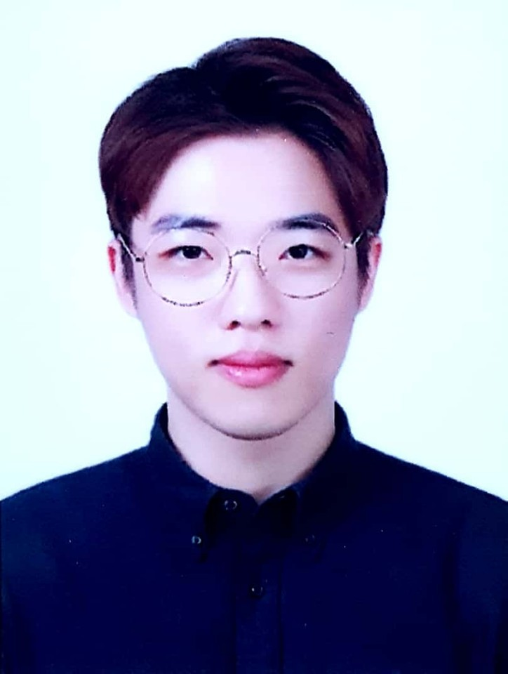

## Sang Jun Lee                           
{: style="text-align: center"}

{: refdef: style="text-align: center;"}
{: width="144px" height="192px"}
{: refdef}

Why not change the world?

I sincerely want to change the world using my techniques and technologies

with my creative heart and full enthusiasm.

----------------------------

Master Course
{: style="text-align: left"}
Dept. of Information Technology
{: style="text-align: left"}
Handong Global University
{: style="text-align: left"}
eowjd4@naver.com | +82-10-9551-5598
{: style="text-align: right"}
317(b) OH, 558 Handong-ro, Buk-gu,
{: style="text-align: right"}
Pohang, Kyongbuk, South Korea (37554)
{: style="text-align: right"}

### Research interests
Visual SLAM, Optimization, CV, CG, Deep Learning, Machine Learning, AR, Autonomous Driving Car, Robotics

### Education and Employments

*  Aug 2017 - Present       M.S in Dept. of Information Technology, HGU 

*  Mar 2012 - Aug 2017      B.S in Computer Science and Engineering, HGU

### Publications

6. **Sang Jun Lee**, Sung Soo Hwang, 'FAST AND ROBUST VANISHING POINT DETECTION ON UN-CALIBRATED IMAGES', IEEE, International Conference on Image Processing, 2018. 

5. **Sang Jun Lee**, Sung Soo Hwang, "아웃라이어에 강인한 가우시안 매핑 기반 선분 병합 방법", IPIU, 2018.
 
4. **Sang Jun Lee**, Su Bin Kim and Sung Soo Hwang, "A Multi 3D Objects Augmentation System Using Rubik’s Cube," Journal of Korea Multimedia Society, Vol. 20, No. 8, pp. 1224~1235, 2017.

3. **Sang Jun Lee**, Su Bin Kim and Sung Soo Hwang, "A Reliable Line Detection Algorithm Using Clustering and Strongly Connected Graph," 한국정보과학회 학술발표논문집, , pp. 1979~1981, 2017.

3. Jae Won Kam, Han Sol Kim, **Sang Jun Lee**, Sung Soo Hwang, "다수 Monocular SLAM 영상 지도에 대한 융합 기법", IPIU, 2019.

3. Davin Baik, Seongjin Lee, Sangyeon Choi, **Sang Jun Lee** and Sungsoo Hwang, "서버/클라이언트를 통신을 통한 영상 인식 기반 위치인식 시스템", 대한전자공학회, 2018.

1. Davin Baik, Seongjin Lee, Sangyeon Choi, **Sang Jun Lee** and Sung Soo Hwang, "Interactive Mobile Augmented Reality System Using Muscle Sensor," 한국HCI학회 학술대회, , pp. 753~756, 2018.

2. Su bin Kim, Dero Bae, **Sang Jun Lee**, Dabin Sin and Sung Soo hwang, "A Study on Providing Resource-efficient Information Interface Utilizing Augmented Reality," 한국HCI학회 학술대회, , pp. 657~660, 2017.

### Awards and Scholarships

3. **Best paper award**, 2018 - **Sang-Jun Lee**, Sung Soo Hwang, 2018, "아웃라이어에 강인한 가우시안 매핑 기반 선분 병합 방법", IPIU

2. **Best paper award**, 2017 - **Sang-Jun Lee**, Su-Bin Kim and Sung-Soo Hwang, 2017, "A Reliable Line Detection Algorithm Using Clustering and Strongly Connected Graph," 한국정보과학회 학술발표논문집, , pp. 1979~1981.

1. Start-up competition **1st prize**(2015. 10) - 영상처리를 이용한 빠른 옷 검색 서비스, **이상준**, 송지웅

### Patents

다양한 패턴에 따라 물체를 증강시키는 큐브 증강현실 장치

### Research Experiences

7. Research assistant, 3DoF+ 360도 비디오 부호화 포맷 변환을 통한 부호화 성능 개선 연구, ETRI 2018. 07. ~ 2018. 011.

6. Research assistant, Vadas 2018. 01. ~ 2018. 09.

5. Research assistant, 빠른 위치 인식 및 정밀한 지형 복원을 위한 다중 정밀도 3차원 영상 지도 생성 기법에 대한 연구 2016. 11. ~ 2018. 09.

4. Research assistant, 스마트 웨어러블 디바이스 및 감성 서비스 어플리케이션 개발 2016. 01. ~ 2018. 02.

3. Research assistant, 빔 프로젝터를 통해 투사된 영상과 사용자간의 상호작용을 인식하는 시스템 개발 2016. 01. ~ 2016. 12.

2. Developer, 사파리고 증강현실 어플리케이션 개발 2016. 09. ~ 2016. 11.

2. Research assistant, 자동 유닛-테스트 생성기법을 활용한 소프트웨어 성능결함 검출 2015. 11. ~ 2016. 11.

1. animator 표면개질용 125J-HZ급 레이저 개발 2015. 06. ~ 2017. 06.

### Teaching Experiences

7. instructor, CG modeling and texturing, Gift Sharing, HanDong Education Development Institute(2016. 01, 2017. 01)

1. Teaching assistant, 제4차 서울IoT워크숍 opencv, 서울산업진흥원, 서울IoT센터, 2018. 07. ~ 2018. 07.

1. Teaching assistant, AR Camp, CS, HGU, 2017. 07. ~ 2017. 07.

1. Teaching assistant, OpenCV Camp, CS, HGU, 2017. 01. ~ 2017. 01.

1. Teaching assistant, Multimedia Image Processing, CS, HGU, 2017. 09. ~ 2017. 12.

1. Teaching assistant, Multimedia Image Processing, CS, HGU, 2016. 09. ~ 2016. 12.

### Skills

|:------------:|:------------|
|Programming Language | C++, C, Python, MATLAB, linux|
|OpenSource LIBRARY | OpenCV, OpenGL, VLfeat, PCL|
|Technical TOOLS | Maya, Photoshop, Illustrator, After Effect, Unity3D|
|Experiments | Kinect, Nuke, Zbrush, Syntheyes, UVlayout|

### Activities

8. Research assistant for CGVLAB(Computer Vision and Graphics Laboratory) (2015. 09~ Present)

6. president of Handong VR group for generating own college virtual world(2015. 03~ 2016. 12)

5. teacher for dance(poppin), artschool in handong global university(2015. 09 ~ 2016. 12)

4. dancer on dancing group 'zizzy' on handong global university(2012. 09~ present)

3. talent competition 3rd prize(2015. 05, dance) and 2nd prize(2016.05, dance as leader) on handong festival 

3. choreographer of musical team and instructor of worship dance team on Bupyeong Methodist Church(2014. 03. ~ 2014. 12) 

2. certification of 3D animiation & Visual Effect Course, SF Film School(school of VFX) (2014. 03 ~ 2014. 12)

1. learned product design by minor(2013.03~ 2014.02)
