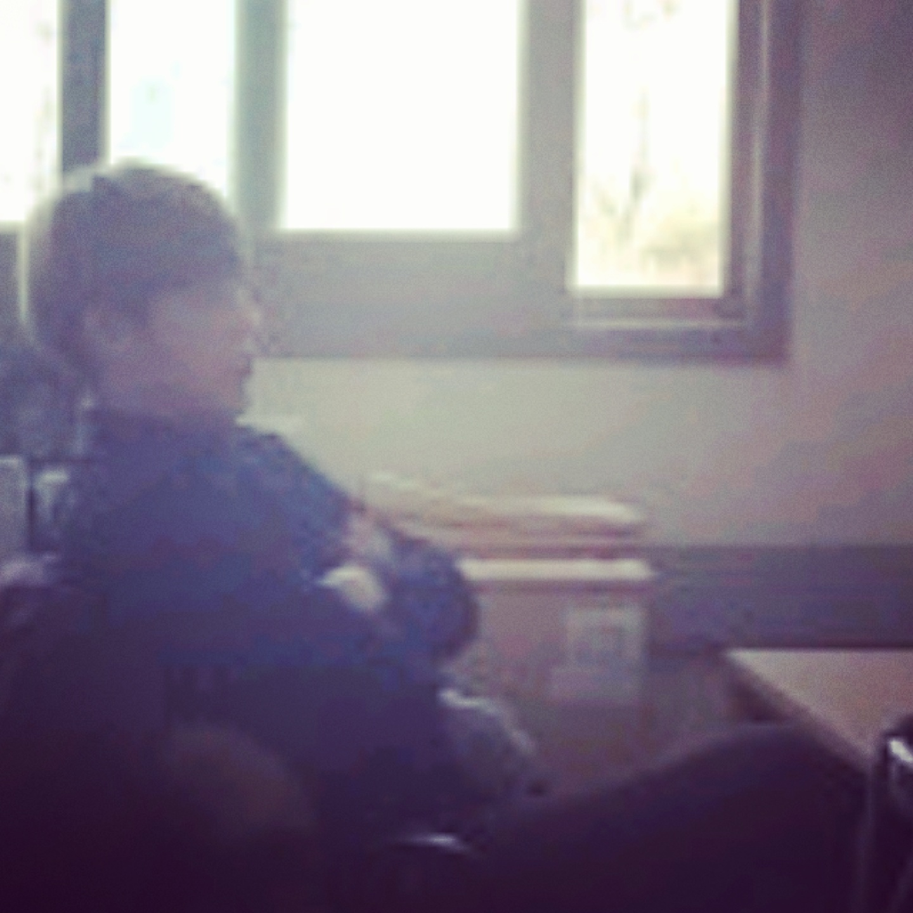

## <centor>Sang Jun Lee</centor>                            

{: refdef: style="text-align: center;"}
{: width="150px" height="150px"}
{: refdef}

Why not change the world?

I sincerely want to change the world using my techniques and technologies

with my creative heart and full enthusiasm.

----------------------------

Bechelor's & Master's Course
{: style="text-align: left"}
Dept. of Information Technology
{: style="text-align: left"}
Handong Global University
{: style="text-align: left"}
21731006@handong.edu +82-10-9551-5598
{: style="text-align: right"}
317(b) OH, 558 Handong-ro, Buk-gu,
{: style="text-align: right"}
Pohang, Kyongbuk, South Korea (37554)
{: style="text-align: right"}

### Research interests
Visual SLAM, Optimization, Computer Vision, Computer Graphics, Deep Learning, Machine Learning, HCI, VR, AR

### Education and Employments

*  Jan 2017 - Present       B.S & M.S in Dept. of Information Technology, HGU 

*  Mar 2012 - Aug 2017      B.S in Computer Science and Engineering, HGU

### Publications

5. Sang-Jun Lee, Sung Soo Hwang, 2018, "아웃라이어에 강인한 가우시안 매핑 기반 선분 병합 방법", IPIU
 
4. Sang Jun Lee, Soo Bin Kim and Sung Soo Hwang, 2017, "A Multi 3D Objects Augmentation System Using Rubik’s Cube," Journal of Korea Multimedia Society, Vol. 20, No. 8, pp. 1224~1235.

3. Sang-Jun Lee, Su-Bin Kim and Sung-Soo Hwang, 2017, "A Reliable Line Detection Algorithm Using Clustering and Strongly Connected Graph," 한국정보과학회 학술발표논문집, , pp. 1979~1981.

2. Subin Kim, Dero Bae, SangJun Lee, Dabin Sin and Seoungsu hwang, 2017, "A Study on Providing Resource-efficient Information Interface Utilizing Augmented Reality," 한국HCI학회 학술대회, , pp. 657~660.

1. Davin Baik, Seongjin Lee, Sangyeon Choi, SangJun Lee and Sungsoo Hwang, 2018, "Interactive Mobile Augmented Reality System Using Muscle Sensor," 한국HCI학회 학술대회, , pp. 753~756.

### Awards and Scholarships

3. Best paper award, 2018 - Sang-Jun Lee, Sung Soo Hwang, 2018, "아웃라이어에 강인한 가우시안 매핑 기반 선분 병합 방법", IPIU

2. Best paper award, 2017 - Sang-Jun Lee, Su-Bin Kim and Sung-Soo Hwang, 2017, "A Reliable Line Detection Algorithm Using Clustering and Strongly Connected Graph," 한국정보과학회 학술발표논문집, , pp. 1979~1981.

1. Start-up competition ? award(2015. 10) - 영상처리를 이용한 빠른 옷 검색 서비스, team Ada, 송지웅, 이상준

### Patents

큐브 증강현실 (pending)

### Experiences

8. Research assistant, 빠른 위치 인식 및 정밀한 지형 복원을 위한 다중 정밀도 3차원 영상 지도 생성 기법에 대한 연구(2차) 2017. 11. 01 ~ 2018. 08. 31

7. Research assistant, 스마트 웨어러블 디바이스 및 감성 서비스 어플리케이션 개발(2차) 2017. 01. 01 ~ 2018. 01. 31

6. Research assistant, 스마트 웨어러블 디바이스 및 감성 서비스 어플리케이션 개발 2015. 12. 31 ~ 2018. 01. 31

5. Research assistant, 빠른 위치 인식 및 정밀한 지형 복원을 위한 다중 정밀도 3차원 영상 지도 생성 기법에 대한 연구 2016. 11. 01 ~ 2017. 10. 31

4. animator, 표면개질용 125J-HZ급 레이저 개발 (3차) 2016. 06. 01 ~ 2017. 05. 31

3. Research assistant, 빔 프로젝터를 통해 투사된 영상과 사용자간의 상호작용을 인식하는 시스템 개발 2016. 01. 02 ~ 2016. 11. 30

2. Research assistant, 자동 유닛-테스트 생성기법을 활용한 소프트웨어 성능결함 검출 2015. 11. 01 ~ 2016. 10. 31

1. animator 표면개질용 125J-HZ급 레이저 개발 (2차), 2015. 06. 01 ~ 2016. 05. 31

### Skills

|:------------:|:------------|
|Language | C++, C, MATLAB, linux|
|LIBRARY | OpenCV, OpenGL, VLfeat|
|TOOLS | Maya, Photoshop, Illustrator, After Effect, Unity3D|

### Activities

8. Research assistant of CGVLAB(Computer Vision and Graphics Laboratory) (2015. 09~ Present)

7. instructor, CG modeling and texturing, Gift Sharing, HanDong Education Development Institute(2016. 01, 2017. 01)

6. president of Handong VR group for generating own college virtual world(2015. 03~ 2016. 12)

5. teacher for dance(poppin), artschool in handong global university(2015. 09 ~ 2016. 12)

4. dancer on dancing group 'zizzy' on handong global university(2012. 09~ present)

3. talent competition 3rd prize(2015. 05, dance) and 2nd prize(2016.05, dance as leader) on handong festival 

2. certification of 3D animiation & Visual Effect Course, SF Film School(school of VFX) (2014. 03 ~ 2014. 12)

1. learned product design by minor(2013.03~ 2014.02)
